# API-Dylan
## Dag 1 (1 april)
### Werkzaamheden
Vandaag ben ik thuisgebleven want ik voelde me helemaal niet lekker. Helaas geen goed begin van het vak want ik heb veel uitleg gemist. Melvin heeft me wel op de hoogte gehouden van wat we met dit vak gaan doen, maar ik sta wel al gelijk een stap achter aangezien ik geen workshops/voorbeelden heb gezien.
De opdracht is: Maak een server side rendered (SSR) website die gebruik maakt van web- en content APIs.

Ik ben vandaag vooral bezig geweest met kijken wat ik gemist heb, de opdracht proberen te snappen en ik ben vooral bezig geweest met Node installeren en Astro werkend maken. Ik heb een tijdje vast gezeten maar uiteindelijk is het gelukt.

### Checkout met Melvin
Melvin voelde zich net als ik niet zo lekker en was eerder naar huis gegaan. Ik heb samen met hem de checkout gedaan. Verder heeft hij me geholpen met Astro waar ik nog vast liep. 

### Week Overzicht:
Op donderdag heb ik gesprek gehad met mijn clubje + Cyd. Ik heb 3 concepten
1 - Video Game Trivia - Je krijgt vragen uit een API op basis van moeilijkheidsgraad en over spellen die je wel/niet kent. Je antwoorden worden opgeslagen met LocalStorage en je maakt gebruik van pointer events om 

Content API: Open Trivia Database (OpenTDB)
Web API #1: Localstorage
Web API #2: 

Ik had hier een klein prototype van gemaakt waarin random vragen gegenereerd worden met 4 antwoorden, waarvan 3 fout en 1 goed is.

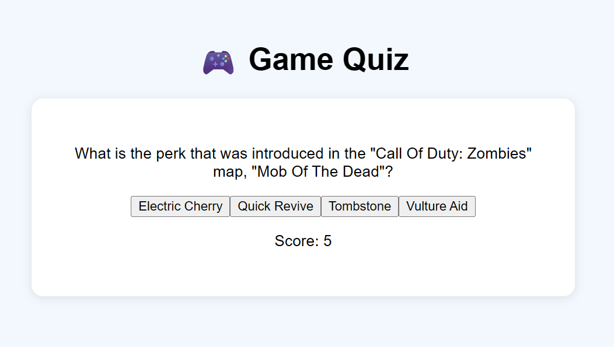

Multiplayer quiz: websocket api

2 - Interactief pokemon spel. Je kunt pokemon vinden op basis van verschillende factoren, zoals tijd en locatie en kunt een team samen stellen. Verder kun je met een controller rondbewegen in een wereld weergegeven op een canvas.
Content API: PokeAPI
Web API #1: Gamepad
Web API #2: Canvas

Ik heb het voor elkaar gekregen om pokemon vanuit de API in te laden.

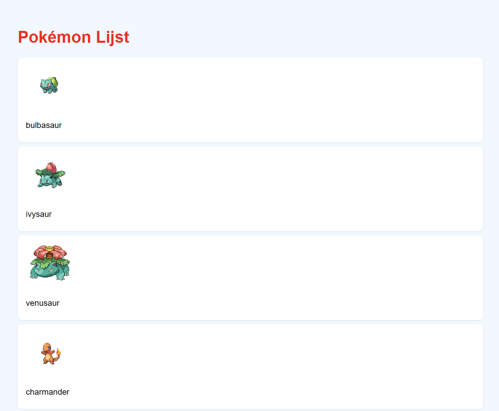

3 - Levels uit een API. Er worden verschillende levels uit een API opgehaald die je kunt spelen. Ik heb nog geen concreet plan. Denk aan verschillende platformer levels, doolhoven, puzzels etc.
Content API: ?
Web API #1: ?
Web API #2: ?

Formule 1 Kaarten


Ik heb uiteindelijk na feedback van Cyd en mijn clubje gekozen voor het pokemon idee met de nadruk op het kunnen lopen in een wereld met een canvas en daarin op verschillende plekken, verschillende pokemon tegenkomen.


## Dag 2 (8 april)
Vandaag hebben we in de ochtend een college gehad over de indeling van Astro, over layouts, components etc. Hier heb ik wel veel aan gehad. Ik heb nu in mijn eigen website ook een index, een main layout met daarin de content, een header en een footer. Daarnaast zitten er in de index nog kaarten voor alle pokemon. Deze worden ook uit een component gehaald. Verder heb ik nog een global.css voor de globale stylings.

Op mijn index heb ik nu een overzicht van alle pokemon. Het zijn er 493 want dat is generatie 1 t/m 4. Verder kun je op alle kaarten klikken en op een detail pagina komen. Elke pokemon heeft een detail pagina. De pagina heet [name].astro waarin de naam wordt vervangen met de naam van de pokemon. Momenteel laadt ik de API op zowel de index als de detailpagina, dus ik moet daar nog een oplossing voor vinden, want nu heb ik 2x dezelfde code wat ik uiteraard liever niet heb.


### Checkout met Sabrina
Vandaag ben ik gerandomized met Sabrina. Zij heeft een idee over Harry Potter spells en heeft nu een canvas waarop je kunt tekenen. Ik heb laten zien wat ik nu heb. Morgen ben ik van plan om een random pokemon te laten spawnen en deze te kunnen filteren met knoppen.


## Dag 3 (9 april)
### Werkzaamheden
Vandaag ben ik in de ochtend bezig geweest met de detailpagina. Ik heb ervoor gezorgd dat dat deze nu iets meer styling heeft. Ik wil nog wat meer doen maar voor nu is het een goede basis. Daarnaast wilde ik dat ik niet de API op 2 aparte paginas moest inladen. Ik heb met hulp van Jad een shared.ts bestand gemaakt die dan wordt geimporteerd op elke pagina. Nu is mijn code iets meer DRY en als ik het aantal pokemon wil aanpassen hoef ik nu op maar 1 pagina code aan te passen.

Verder heb ik een nieuwe pagina toegevoegd. Voor nu heet deze de randomizer. Op deze pagina heb je een knop en daarmee komt een willekeurige pokemon. Wat leuk! Daarna heb ik ervoor gezorgd dat je kan filteren op types. Bijvoorbeeld als je filtert op FIRE, kun je alleen maar vuur pokemon tegenkomen zoals Charmander, Ponyta etc. 

Daarnaast wilde ik slider hebben waarmee je de "sterkte" van de pokemon kon bepalen. Als de slider laag staat kom je waarschijnlijk een zwakke pokemon tegen en als de slider hoog staat kom je een sterke pokemon tegen. Ik bedoel hiermee niet alleen de ATK stats, maar de gecombineerde stats van ze allemaal. Ik heb wel even moeten sleutelen om dit goed te doen. Er zijn namelijk pokemon, zoals bv. Geodude, met hoge DEF maar slechte andere stats. Als je het gemiddelde van alle stats calculeert zou Geodude juist heel hoog plaatsen ondanks hij een van de lagere hoort te zijn. Ik heb ervoor gezorgd dat als maar 1 stat hoog zit en de rest niet dat deze dan minder telt. Ik heb nu een systeem die wel prima is, niet perfect maar goed genoeg. Zolang ik niet individuele pokemon hoef te filteren is dit al best goed.

In de tussentijd heb ik zowel de overzichts, als de detailpagina in de header gezet. Je kan nu van de ene pagina naar de ander. Detail staat er natuurlijk niet in want die is voor elke pokemon uniek.

Nog 2 dingen die ik aan de randomizerpagina heb toegevoegd. Ten eerste heb ik 4 willekeurige moves die de pokemon kan leren toegevoegd. Deze zullen random bepaald worden. De moves worden uit de API gehaald. Daarnaast heb ik een vang systeem toegevoegd. Elke pokemon heeft een eigen catch rate wanneer ze met een pokeball gevangen worden. Deze wordt toegepast. Als je probeert te vangen dan heb je een bepaalde kans dat je de pokemon krijgt of hij breekt los. Als hij los breekt, komt er een tekst in beeld. Als je hem vangt wordt de pokemon aan een lijst toegevoegd. Ik heb ervoor gezorgd dat de lijst te zien is in de footer. De footer wordt alleen nog niet geupdatet per pagina. Hier wil ik localstorage voor gebruiken. 


### Checkout met Maja
Vandaag werd ik gerandomized met Maja. Zij is bezig met een DND Character builder. Afhankelijk van keuzes die je maakt heeft het karakter verschillende stats, best wel nice. Ik ben zelf van plan om volgende week mijn idee met het canvas uit te werken aangezien het daar wel tijd voor wordt.

## Week 2 Overzicht
Deze week ben ik begonnen met mijn definitieve site, het wordt de pokemon wereld waar je verschillende pokemon kunt vangen. Om te beginnen heb ik Astro werkend gekregen, heb ik geleerd over layouts, components etc. Ik heb mijn code ingedeeld op een manier dat voor mij handig en overzichtelijk is.

Om te beginnen heb ik een overzichtspagina. Hierin worden alle pokemon geladen. Ik kan zelf bepalen hoeveel dat er zijn. Momenteel zijn het 151 aangezien dat de eerste generatie is, maar het liefst doe ik generatie 1 t/m 4, wat optelt tot 493 pokemon. Je ziet alle pokemon op volgorde van pokedex nummer en ziet de naam, de official artwork, de battle sprite en een shiny sprite. Elke kaart die je ziet is een component, zo kan ik makkelijk aanpasssingen maken aan de styling.

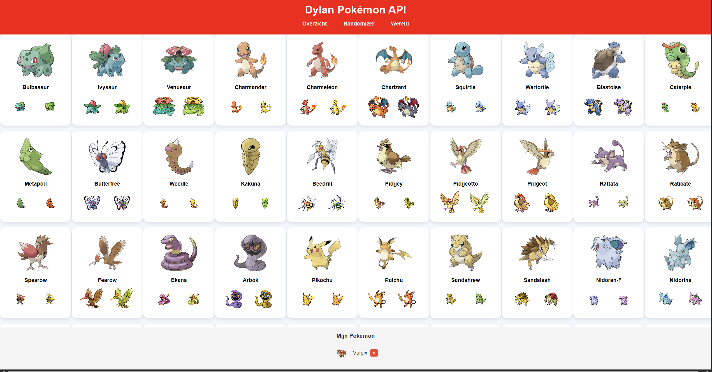

Als je op een kaart klikt, kom je op de detailpagina van deze pokemon. Dit heb ik gedaan door dit astro bestand [name].astro te noemen, waarvan de name wordt vervangen door de naam voor elke pokemon. Zo heeft elke pokemon een eigen detailpagina zonder dat ik 500 verschillende paginas hoef te maken. Op dit moment heb ik wat standaard informatie over elke pokemon erin gezet, waaronder de typing, base stats, abilities, lengte, gewicht etc.

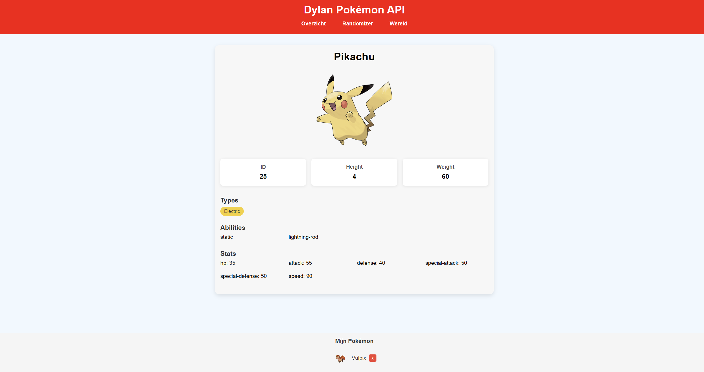

Het doel van de website wordt uiteindelijk om verschillende pokemon te kunnen vinden en deze te kunnen vangen. Het is mij aangeraden om dit eerst allemaal met buttons te doen voordat ik met canvas dingen ga doen dus ik heb een pagina gemaakt genaamd randomizer, waarin je op een knop kunt drukken, deze een random pokemon ophaalt met 4 moves die hij kan leren en je de optie hebt om deze te kunnen vangen. Elke pokemon heeft een eigen catch rate, ook uit de API. Als je een pokemon hebt gevangen kun je deze zien in de footer. Ik heb gebruikt gemaakt van Localstorage zodat deze opgeslagen zouden blijven, ook wanneer je van pagina wisselt. Op de randomizer kun je ook filteren op type en zelfs de sterkte van de pokemon bepalen. De sterkte is gebaseerd op alle base stats van een pokemon bij elkaar, dus HP, ATK, DEF etc. Wat me opviel is dat er een paar objectief slechte pokemon bij de sterke zaten waaronder bv. Geodude. Dat komt omdat zijn defense heel hoog is maar de rest van zijn stats niet. Om dit op te lossen heb ik ervoor gezorgd dat als maar 1 stat heel goed is en de rest niet, deze minder sterk meetelt.

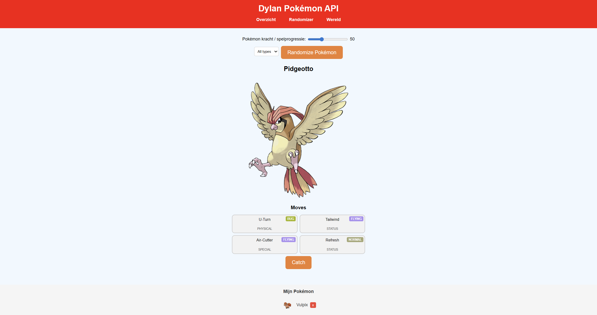

Verder had ik vrijdag nog het gesprek met mijn clubje + Cyd, hiervan de aantekeningen:
- Hover state moet weg als er geen klik is, grote pet peeve van Cyd
- Pokemon trading card styling voor detailpagina, wel een leuk idee. 
- Localstorage voor pokemon lijst.
- Focus op de wereld maken, mijn unieke functie moet ik nu wel echt aan beginnen, dus volgende week gaan we canvas doen.


## Dag 4 (15 april)
### Werkzaamheden
Vandaag ben ik thuisgebleven aangezien ik dacht dat er vandaag geen docenten aanwezig zouden zijn. Blijkbaar had Jad vandaag lesgegeven, maar dat had ik zelf niet gezien. In de planning staat deze hele week leeg, dus dat had ik niet echt kunnen weten. Morgen ben ik van plan om wel te komen.

Ik kreeg vorige week als feedback om echt te gaan beginnen met mijn unieke functie, dus dat ben ik gaan doen. Ik heb vandaag (en deels vorige week vrijdag) mijn canvas werkend gekregen. Ik had hier al ervaring mee in Sprint0 en vorige jaren dus dit ging me al best goed af. Ik heb een gebied gemaakt waarin je rond kunt lopen met WASD. Verder als je bij de rand van het scherm komt, dan stopt de camera met bewegen.

Ik heb een tilemap gevonden online. Bron staat in de bronnenlijst. Deze lijkt me wel geschikt aangezien er veel graspaden zijn, oftewel veel verschillende pokemon mogelijkheden. Het liefst had ik wel meer variatie in de wereld, maar ik wil niet te veel tijd besteden aan een hele map zelf maken, dus we zullen het hiermee doen. Misschien ga ik de PNG nog een beetje met kleur aanpassen om meer typings aan te duiden.

Ik heb veel tijd besteed aan collisions. Aangezien de hele map een PNG is, inclusief de bomen en stenen, moet ik alle collision er handmatig inzetten. Ik heb dus overal onzichtbare (of voor nu roodgekleurde) muren neergezet om ervoor te zorgen dat de speler niet door bomen heen kan lopen en buiten bounds heen kan. 

Als laatste heb ik nog een speler sprite toegevoegd. Deze staat ook in de bronnenlijst. Het zijn 16 sprites, 4 voor elke zijde inclusief staan en lopen. 


### Checkout met Melvin
Omdat we allebei vanuit huis zijn wezen werken, hebben we wederom samen checkout gedaan. Ik heb nu een canvas waarin je kunt rondlopen met toegevoegde hitboxes voor collision met muren en hij is bezig met AR waarmee hij pokemon op zijn camera zichtbaar kan maken die met je mee bewegen aan de hand van de positie van je gezicht. Best tof. Morgen ga ik proberen om het gras in de wereld werkend te maken en dan pokemon te laten spawnen. Ik moet mijn scripts gaan combineren. Verder wil ik localstorage gaan gebruiken voor de pokemon die je vangt. Ook moet ik nog even code toevoegen om een vaste framerate in te stellen, zodat het spel niet te snel/langzaam loopt op bepaalde devices. 


## Dag 5 (16 april)
### Werkzaamheden
Vandaag ben ik wel naar school gegaan. Het lokaal was bezet maar aan de andere kant van de gang was het vrij, dus kon ik daar werken. Ik heb vandaag de collisions afgemaakt, alle muren staan nu goed. Ik heb een hoop gepriegeld met de coordinaten totdat ik er tevreden mee was. Vervolgens heb ik gras toegevoegd. Hier heb ik ook alle hitboxes voor ingezet met alle coordinaten. Ik heb losse bestanden gemaakt voor alle locaties van de muren/het gras. Als je door het gras loopt, heb je kans dat je wordt doorgestuurd naar de randomizer pagina. Dit werkt door een random waarde te geven wanneer je het gras aanraakt die steeds meer omlaag gaat als je erin loopt. Ik moet even goed gaan nadenken over hoe ik het er precies uit wil laten zien. Moet de randomizer code op de canvas? Blijven het meerdere pagina's. Wat ga ik met de header doen? Dit zijn de keuzes die ik moet maken. Ik zit er aan te denken om de header gewoon een paar fixed buttons maken die in de hoeken te zien zijn, zodat je de hele canvas full screen kan gebruiken.

### Checkout met Melvin
Wederom heb ik mijn checkout met Melvin gedaan. Hij heeft meer progressie gemaakt aan zijn AR idee en heeft meer styling erin zitten. Ik moet zelf ook aan de bak met mijn styling. Ik wil voor de detailpagina Pokemon trading card styling toepassen. Verder moet ook de overzichts, randomizer en canvas pagina gedaan worden.

## Week 3 Overzicht
Deze week heb ik het canvas geimplementeerd waarin we in een wereld kunnen lopen net zoals in het echte pokemon spel. Ik heb een achtergrond gevonden waarin je kunt lopen en een spritesheet voor de speler. Deze heeft 4 richtingen elk met 3 loop en 1 sta sprite, in totaal 16 sprites. Je kunt de speler besturen met WASD of met de pijltoetsen.Er is ook een loopanimatie gemaakt met de spritesheet. De map beweegt mee om ervoor te zorgen dat de speler niet buiten beeld loopt. 

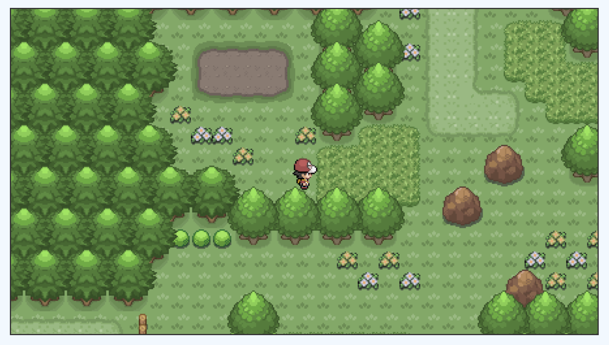

Om ervoor te zorgen dat je niet door bomen heen kunt lopen, heb ik voor alle "muren" in het spel een hitbox toegevoegd, hier ben ik een lange tijd mee bezig geweest aangezien ik voor ze allemaal aparte coordinaten nodig had. Als de speler hier tegenaan loopt. De hitboxes voor muur collisions zijn roodgekleurd. Daarnaast heb ik ook gras toegevoegd, wanneer je in het gras loopt heb je kans om een pokemon tegen te komen. Momenteel word je nog gebracht naar de randomizer pagina. Ik ben van plan om de randomizer functie nog te implementeren in de canvas.

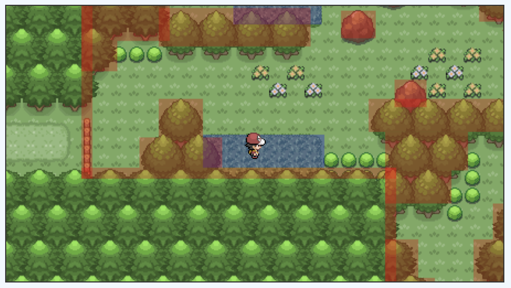

Deze week was The Web you Want, wat betekent dat er geen voortgangsgesprek was. Wel heb ik donderdag nog kort met Cyd gezeten. Zij heeft nog suggesties gegeven om de navigatie meer te implementeren in het canvas en om het canvas fullscreen te maken.


## Dag 6 (22 april)
### Werkzaamheden
Vandaag hebben we een college gehad over onze site online zetten op onrender. Dit ging wel goed, ik had na wat hulp van Jad hem succesvol online gekregen. Wel waren mijn canvas en mijn randomizer gesloopt. Dit kwam omdat de canvas images niet werden opgehaald aangezien deze niet te bereiken waren door de renderer. Ditzelfde geldt voor het script voor de localstorage. Toen ik eenmaal alles verplaatst had deed alles het weer goed.

Verder ben ik vandaag vooral bezig geweest met styling. Vooral aan de detailpagina heb ik veel gewerkt. Ik had het idee gekregen om de detailpagina te baseren op pokemon kaarten. Ik heb de styling van de pokemon TCG toegpepast op de detailpagina met de informatie die ik uit de API kan halen.

Verder heb ik de overzichtspagina en de header beter gestyled. Ik heb verschillende dingen geprobeerd, veel waren of te saai of hadden te veel felle kleuren. Uiteindelijk heb ik gekozen voor een soort laboratorium gevoel. Dit heb ik toegepast op de header, overzichts- en detailpagina.

Dit ging allemaal wel goed, maar ik moet vaak mijn site opnieuw opstarten zodat de styling wordt toegepast.

### Checkout met Melvin
vandaag werd ik gerandomized met Aya A. Maar omdat ze niet in het lokaal was heb ik hem wederom gedaan met Melvin. Hij is bezig geweest met styling voor zijn knoppen, heeft hij zijn code schoner gemaakt en ook zijn repo online gezet. Hij gaat morgen aan detailpagina en UI werken. Ik ga morgen mijn randomizer combineren met mijn canvas. Verder wil ik de styling voor allebei die pagina's dan gaan fixen.

## Dag 7 (23 april)
### Werkzaamheden
Vandaag wil ik de randomizer implementeren in de canvas. Ik heb eerst wel nog in de ochtend wat aanpassingen gemaakt aan de detailpagina. Je kunt nu ook de kaarten zien van de pokemon voor en na de huidige in de pokedex, nu is er wat minder lege ruimte en voelt het al een stuk meer compleet.

Ik wilde eerst de code van de randomizer combineren met de code van de canvas met meerdere scripts, maar dat was te onoverzichtelijk voor me dus ik heb alles nu in het canvas script staan. De randomizer pagina bestaat wel nog los, maar heeft geen invloed op de canvas pagina. Als je nu in het gras loopt heb je kans dat een pokemon in beeld komt. Het spel pauzeert dan en je krijgt de optie om deze te vangen of weg te rennen.

Ik heb een battle achtergrond online gevonden die ik heb geimplementeerd in mijn spel. Verder heb ik de battle sprite van de gerandomizede pokemon rechtsboven neergezet op een plek die goed past. Niet elke pokekmon kwam even goed terecht aangezien de verschillende groottes. Een kleine pokemon kwam bv. te hoog maar een grote daarentegen te laag. Ik heb een beetje gesleutelt met het middenpunt en heb het nu zo goed als ik het voor elkaar kon krijgen. Niet perfect, maar goed genoeg. 

Daarnaast wilde ik ook dat je eigen pokemon te zien is, net als in Pokemon. Hiervoor moest ik de back sprites ophalen. Ik heb ervoor gezorgd dat de pokemon in je localstorage worden opgehaald en de eerste pokemon uit die lijst wordt laten zien. Ik moest rekening houden met het feit dat deze pokemon al van tevoren een backsprite moeten hebben ingeladen. 

Als laatste nog over Render, de canvas laadt soms niet en laat alleen zwart beeld zien. Op localhost heb ik dat probleem niet. Dit gebeurt alleen soms en als ik de pagina ververs dan doet hij het meestal wel. Ik weet niet waar dat aan kan liggen. Misschien omdat ik 493 pokemon aan het laden ben, maar zelfs dat betwijfel ik. Ik wil hier nog naar gaan kijken maar als dat niet lukt dan is het geen ramp.


### Checkout met Romy
Vandaag werd ik gerandomized met Thije, maar hij was er niet. Ik heb mn checkout gedaan met Romy. Zij heeft een Spotify API en daarin kun je liedjes genereren en opslaan. Zij had moeite met nieuwe liedjes genereren via de API die ze gebruikt, dus heeft ze voor nu wat dummy songs in een JSON staan. Ik heb laten zien wat ik heb. Ik heb vandaag veel in het canvas gewerkt. Vandaag was de laatste les, ik zou het leuk vinden om nog een swap functie toe te voegen en heel graag als het kan een battle functie. Maar er werd wel aangeraden om dat alleen te doen als dat echt kan aangezien dat wel een complex project is.

## Week 4 overzicht
Deze week vond ik dat het tijd was om meer styling toe te passen. Ten eerste ben ik bezig geweest met de detailpagina. Ik heb de styling gebaseerd op Pokemon kaarten. De plaatjes en info worden op dezelfde manier gepresenteerd als op een echte TCG kaart. Uiteraard is niet alles hetzelfde aangezien ik geen info heb over specifieke kaarten en wat ze doen, dus heb ik de abilities, 2 moves en wat base stats erop gezet, waardoor het er compleet uitziet samen met de informatie onder het plaatje die hetzelfde is als op de echte kaarten (soort, lengte en gewicht). Ik vond het nog een beetje leeg dus ik heb de vorige en de volgende kaart ook erin gezet met een lage opacity, als jer er op klikt ga je naar die pagina. Ik wil nog een view transition erop gooien als dat niet te veel moeite wordt.

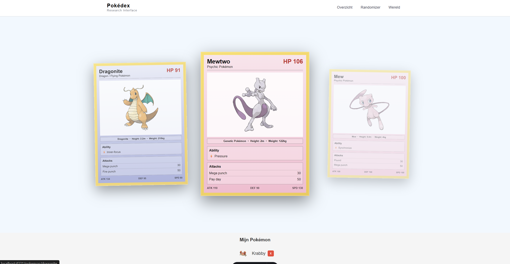

Ook heb ik styling toegepast op de overzichtspagina. Ik heb gekozen voor een soort laboratorium gevoel aangezien in het spel de pokemon bestudeert worden door professors. Ik vind het wel een leuk thema, al is het een beetje simpel. Wat ik verder had geprobeerd was of te leeg, of had te veel felle kleuren.

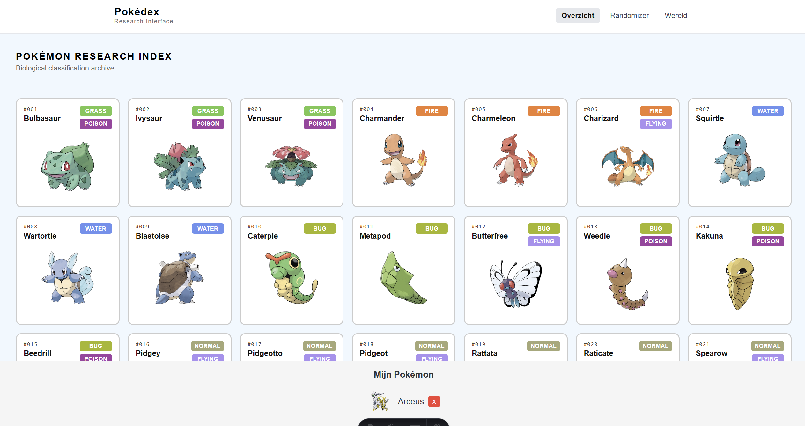

Verder ben ik deze week vooral bezig geweest met het randomizer systeem implementneren in de canvas. Als je nu in het gras loopt heb je kans dat een pokemon tevoorschijn komt op het canvas. Deze is voor nu nog compleet random. Verder heb je de kans om of weg te rennen of hem te vangen. Als je hem vangt wordt deze toegevoegd aan je localstorage.

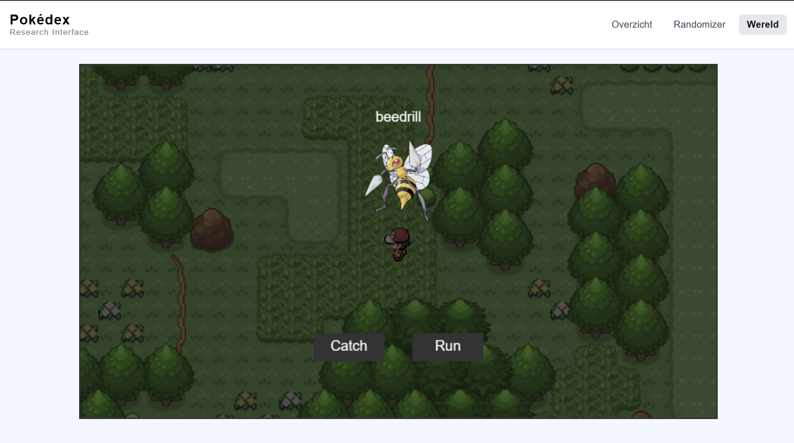

Ik wilde het natuurlijk uit laten zien als het echte spel, dus ik heb een plaatje gevonden voor een battle arena en heb de battle sprite van de pokemon erop gezet. Verder heb ik een back sprite toegevoegd van de eerste pokemon in de localstorage zodat het lijkt op het battle systeem. Dit heeft lang geduurd om te fixen aagezien de pokemon die je al hebt nu ook een backsprite ingeladen moeten hebben, anders werkte het niet. Het liefst wil ik nu ook daadwerkelijk een battle systeem toevoegen. Als ik tijd over heb, wil ik dat wel doen. Ik ga iig wel nog een swap systeem toe voegen zodat je van pokemon kunt swappen. 

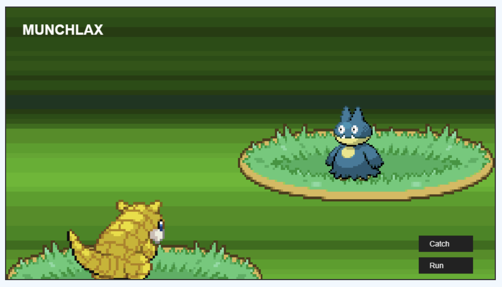

Verder heb ik deze week nog de site online gekregen op render. Ik moest wat dingen aanpassen, zoals de locaties van bepaalde images. Verder is het zo dat het canvas niet altijd laadt wanneer ik op render aan het hosten ben. Als ik de pagina ververs dan doet hij het wel. Ik moet nog kijken of ik dat kan fixen, zo niet is het niet heel erg.

### Gesprek met Cyd & clubje

Aantekeningen.
Design:
- Overzichtspagina moet beter
- Navigatie moet beter of er helemaal uit
- Randomizer hoeft niet in de navigatie  
- Detailpagina achtergrond plaatje
- Detailpagina View transitiions 
- Canvas groter maken
- Footer als side panel

Canvas Logica:
- Verschillende pokemon in elk gras
- Pokemon swappen
- Muren boven/onder
- Minder pokemon, kijken of dat sneller laadt
- Starter Pokemon
- Vechten? :D
- Muziek / SFX
- Betere knoppen tijdens encounter
- Catch animatie
- Encounter animatie (?)

### Meivakantie + Overige dagen
Ik ben in de meivakantie nog bezig geweest met dit vak. Ik had de meeste dagen 1 ding toegevoegd/aangepast aan mijn prototype. Hieronder staat alles waar ik nog mee bezig be geweest.

Ik heb swapfunctie toegevoegd. In de battle zie je naast de run en catch knoppen nu ook een swap knop. Hierbij komt een UI in beeld met alle pokemon die je hebt. Als je een kiest, swap je je pokemon.

De header is nu niet meer een header maar een toggle knop in de hoek. Dit is een stuk meer immersief en past meer bij de vibe van een video game. Nu kan ik ook het canvas full screen maken zonder dat het er slecht uitziet. Verder heb ik de randomizer eruit gehaald. De pagina blijft wel bestaan als debugger maar hoort niet bij de ervaring.


## Bronnenlijst
Video over Astro
Link: https://www.youtube.com/watch?v=dsTXcSeAZq8

Lijst met Web API's
Link: https://developer.mozilla.org/en-US/docs/Web/API

Lijst met content API's 
Link: https://github.com/public-apis/public-apis?utm_source=chatgpt.com

Tilemap
Link: https://projectpokemon.org/home/forums/topic/54669-ndsmm-how-to-map-in-pokemon-gen-4/

Tilemap (degene die ik gebruikt heb)
Link PNG: https://www.rebornevo.com/uploads/monthly_2023_03/Route1.png.f760ee448af075e4c51d29b7d6307e08.png
Link Post: https://www.rebornevo.com/forums/topic/16872-mapscreenshotsprite-showcase/

Unused Pokemon maps
Link: https://tcrf.net/Pok%C3%A9mon_Gold_and_Silver/Unused_Maps

Trainer spritesheet
Link: https://www.deviantart.com/scizorbytes/art/Battle-Legend-Red-Gen-4-Overworld-Sprites-917367151

Cyd's View Transitions
Link: https://www.youtube.com/watch?v=Bq5GVrXO6jE&t=579s

Battle Achtergrond
Link PNG: https://i.imgur.com/lhu26US.png
Link Post: https://www.pokecommunity.com/threads/inserting-battle-backgrounds.302401/ 


# Astro Starter Kit: Basics

```sh
npm create astro@latest -- --template basics
```

> 🧑‍🚀 **Seasoned astronaut?** Delete this file. Have fun!

## 🚀 Project Structure

Inside of your Astro project, you'll see the following folders and files:

```text
/
├── public/
│   └── favicon.svg
├── src
│   ├── assets
│   │   └── astro.svg
│   ├── components
│   │   └── Welcome.astro
│   ├── layouts
│   │   └── Layout.astro
│   └── pages
│       └── index.astro
└── package.json
```

To learn more about the folder structure of an Astro project, refer to [our guide on project structure](https://docs.astro.build/en/basics/project-structure/).

## 🧞 Commands

All commands are run from the root of the project, from a terminal:

| Command                   | Action                                           |
| :------------------------ | :----------------------------------------------- |
| `npm install`             | Installs dependencies                            |
| `npm run dev`             | Starts local dev server at `localhost:4321`      |
| `npm run build`           | Build your production site to `./dist/`          |
| `npm run preview`         | Preview your build locally, before deploying     |
| `npm run astro ...`       | Run CLI commands like `astro add`, `astro check` |
| `npm run astro -- --help` | Get help using the Astro CLI                     |

## 👀 Want to learn more?

Feel free to check [our documentation](https://docs.astro.build) or jump into our [Discord server](https://astro.build/chat).
